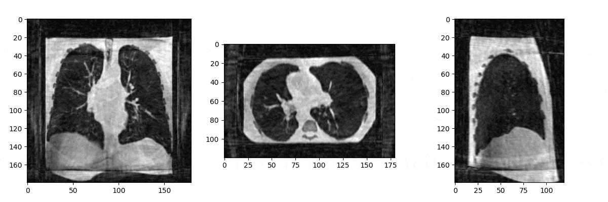

This folder is for simulating dynamic lung MRI. It uses MRzeroCore, which is the recommended way to do simulations.
It is also the complement of the `simulations` project, which itself uses KomaMRI.
Both of these expect data to be pre-formatted by the `simulator-data` project. Have a look at that first in case you may not have.

There are three virtual python environments for this project. They have specific uses, and have an abbreviation so that you can easily tell what environment to use when running code from the list below.
* [Z]: `mrzero-venv`. This is the primary simulations venv. It is used for phantom and sequence generation, as well as running the simulations. Uses python 3.14
* [R]: `recon-venv` or `recon-venv-gpunufft`. It is recommended to use the `gpuNUFFT` variant. It is used for deformation interpolation and reconstructions. Uses python 3.11

Here is a quick run-down of the files and what they do. Run them in this order:
1. [R] `inr_deform_field_gridder.py` -> Interpolate surface lung deformation fields into the entire phantom volume. This is required before making a phantom. It is highly recommended to use the `-f` flag for more coherence in the deformations. 
2. [Z] `create_mr0_phantom.py` -> Create a simulation phantom, ready to use. It also expects to use data in the format prepared by the last script in the `simulator-data` project.
3. [Z] `generate_3d_sequence.py` -> Generate a 3D MRI sequence adapted for dynamic lung MRI. This code uses a radial FLASH UTE sequence, based on the AZTEK k-space sampling pattern. You may use any other sequence in your simulations, so long as it uses the pulseq format (version 1.4)
4. [Z] `run_mri_simulation.py` or `run_mri_simulation_parallel.py` -> Run your simulation on one or many GPUs. The parallel script has a special flag (`--stack-signals`) to fuse simulation parts once all GPU jobs are done (re-run the python script to do that).
5. [R] `reconstruct_simulation_output.marimo.py` or `reconstruct_simulation_output_static.marimo.py` -> Reconstruct simulation outputs into dynamic or static images respectively. Uses the [marimo](https://marimo.io/) notebook format, not Jupyter!

> [!important]
> The `aztek` directory contains a Git submodule to include the AZTEK C source code. You must cd into the directory and run the `generate_so_file.sh` script once before generating sequences with the `generate_3d_sequence.py` script.

> [!note]
> `mr0-sanity-checks` allows you to debug your phantoms and sequences before running a simulation, to see if data is properly formatted and temporally coherent, without going through a full simulation!

`src` has small utilities. Not very useful to an end-user.
